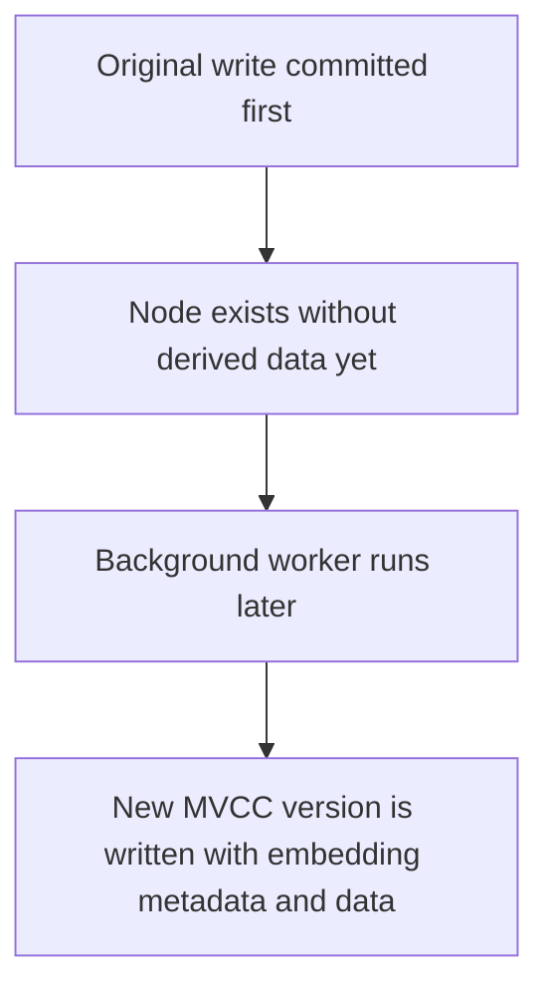
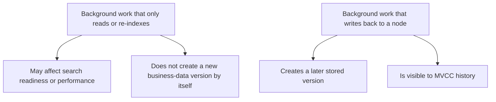
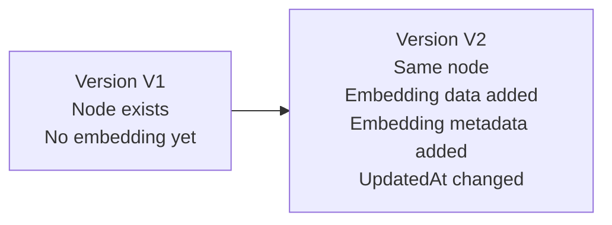
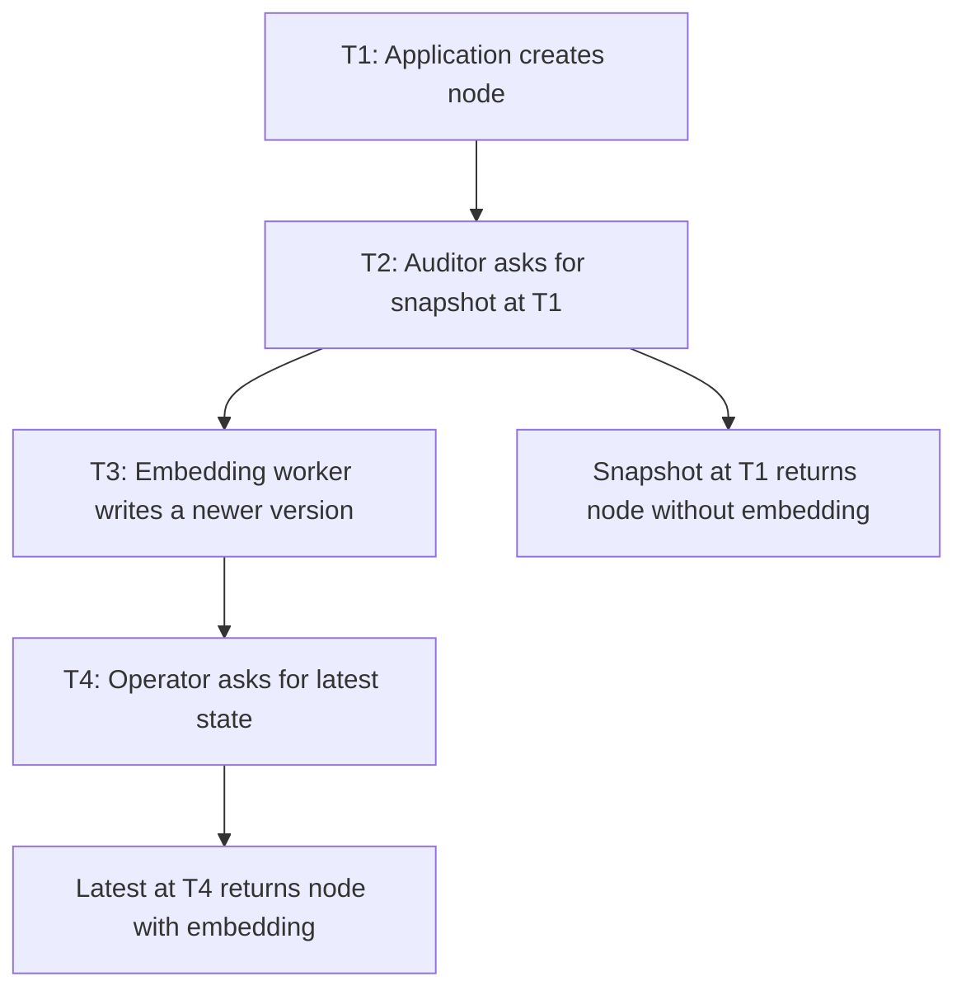
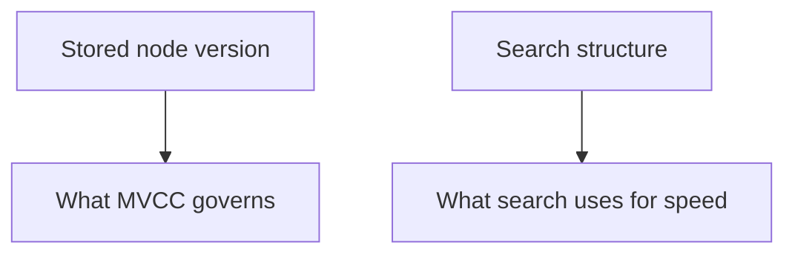

# Background Workers, MVCC, and Audit Evidence

This guide explains, in simple terms, how NornicDB background workers interact with MVCC and what that means for audit, review, and evidence collection.

It is written for:

- auditors
- compliance reviewers
- security reviewers
- operators preparing control evidence

If you need the deeper engineering model, see the linked technical notes throughout this page.[^arch-bg][^mvcc-guide]

## Executive Summary

NornicDB uses background workers for some derived-data tasks, such as generating embeddings for vector search.

Those workers can write back to storage after the original application write has already committed.

That means:

- one business record can have more than one MVCC version over time
- a later version may add derived data such as embeddings
- the later worker write is separate from the original user or application write
- snapshot readers may see a pre-embedding version or a post-embedding version depending on the requested point in time

For audit purposes, the main point is simple:

This is expected behavior, not silent corruption.

## What Is A Background Worker?

A background worker is a process inside the database that performs follow-up work after the main request path returns.

Examples in NornicDB include:

- embedding generation for vector search
- search index synchronization
- MVCC lifecycle maintenance such as prune planning and retention work

Not every background task changes stored business data.

For audit review, the important distinction is:

## The Main Case: Embedding Worker

The embedding worker is the most important background writer for auditors to understand.

Purpose:

- find nodes that need embeddings
- generate vector embeddings from node content
- persist those embeddings and related metadata
- update search structures so vector search can use them

In plain language:

## How MVCC Sees That Work

MVCC means the database can keep a version history of a record over time.

For the embedding worker, the practical effect is:

- the original node version is committed first
- the worker later writes another committed version of the same node
- the newer version includes embedding-related fields and a new update timestamp

Timeline:

This separation is important because it means the database does not pretend that the embedding existed at the time of the original business write.

## What An Auditor Should Conclude

The correct interpretation is:

- the later embedding write is a derived-data update
- it is not the original business event
- it is a real stored state change once committed
- it can appear in later MVCC-visible versions of the node

This is usually acceptable if the reviewer understands that embeddings are derivative artifacts used for search and retrieval, not the primary source record.

## Snapshot Read Implications

Auditors sometimes ask whether two readers can see different states of the same logical node.

The answer is yes, if they read at different MVCC points.

Example:

That is normal MVCC behavior.

## Search And Readiness Implications

The worker is asynchronous.

That means there can be a short period where:

- the node exists in storage
- the embedding is not yet present
- vector search is not yet ready to return the node based on embedding

State model:

For a reviewer, this means "written" and "vector-searchable" are not the same moment.

## Audit Evidence Available Today

Evidence sources available today include:

- MVCC-visible node history and current heads[^mvcc-guide]
- node-level embedding metadata such as embedding model and embedding timestamp
- operational logs from the embedding worker
- queue and aggregate embedding statistics exposed by the server[^audit-logging]
- WAL records that note embedding updates as a distinct operation type[^durability]

## What Is Not Fully Audit-Grade Today

NornicDB currently treats embedding updates as derived and regenerable.

That has two consequences:

1. They are real persisted MVCC updates once committed.
2. They are not yet first-class, human-friendly audit events in the same way as user login, policy change, or explicit data export events.

In practical terms, the current system is strong enough to explain and reconstruct behavior, but it is not yet optimized for auditor-friendly event tracing of each embedding lifecycle step.

Current gaps a reviewer should understand:

- worker logs are operational and troubleshooting-oriented
- queue stats are aggregate counters, not a durable per-node audit trail
- embedding writes are intentionally treated as regenerable during some recovery paths[^durability]
- there is no dedicated compliance report that lists each embedding lifecycle event as a business audit record

## Control Interpretation Guidance

For most compliance reviews, background embedding writes should be classified as:

- derived data generation
- system-managed post-processing
- asynchronous enrichment of an existing record

They should usually not be classified as:

- a new user-authored business event
- a replacement for the original source record
- a hidden mutation of business meaning

## Recommended Auditor Questions

When reviewing a workload that uses vector search, useful questions include:

1. Which background workers can write back to storage?
2. Which node fields are derived versus source-of-record fields?
3. How long can a node remain in the queued-but-not-searchable state?
4. What evidence is retained for worker activity, retries, and failures?
5. Are retention and snapshot policies sufficient to reconstruct pre-worker and post-worker states?

## Simple Review Checklist

- Confirm whether embeddings are enabled for the reviewed environment.
- Confirm whether the workload relies on vector search for user-facing or control-relevant behavior.
- Confirm whether MVCC retention is long enough to preserve the review window.
- Confirm whether current operational logs are sufficient for the control objective.
- Confirm whether a stricter event trail is needed for high-assurance environments.

## Side Note: Why WAL And MVCC Sound Different

You may see two statements that are both true:

- embedding writes become new MVCC versions
- embedding updates may be treated as regenerable during WAL recovery

That is not a contradiction.

Simple explanation:

- MVCC answers: "what versions were committed in storage?"
- WAL recovery policy answers: "which operations are essential to recover exactly versus safe to rebuild later?"

So an embedding update can be:

- a real committed version once it is written
- but still considered rebuildable rather than business-critical during recovery design

## Technical Notes

### Technical Note A: What Usually Changes On The Node

When the embedding worker persists results, it typically adds or updates:

- chunk embedding data
- embedding metadata
- the node update timestamp

This is why the worker write appears as a later node version rather than an invisible side cache.

### Technical Note B: Search Index Sync Is Adjacent But Different

Search index synchronization can happen after the embedding write, but the search index itself is not the same thing as the stored node version.

In simple terms:

That distinction matters when explaining why a node can be committed before it is fully searchable.

## Related Documents

- [Audit Logging](audit-logging.md)
- [Historical Reads & MVCC Retention](../user-guides/historical-reads-mvcc-retention.md)
- [MVCC Lifecycle Admin API](../user-guides/mvcc-lifecycle-admin-api.md)
- [MVCC Lifecycle and Background Work Architecture](../architecture/mvcc-lifecycle-background-work.md)
- [Durability](../operations/durability.md)

[^arch-bg]: Technical background: [MVCC Lifecycle and Background Work Architecture](../architecture/mvcc-lifecycle-background-work.md)

[^mvcc-guide]: Technical background: [Historical Reads & MVCC Retention](../user-guides/historical-reads-mvcc-retention.md)

[^audit-logging]: Audit posture and evidence references: [Audit Logging](audit-logging.md)

[^durability]: Durability and recovery context: [Durability](../operations/durability.md)
