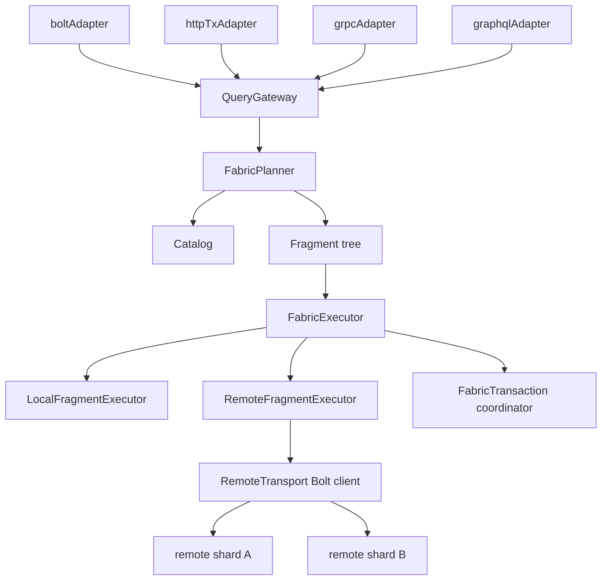

# NornicDB Remote Constituents Plan (Neo4j Fabric-Compatible)

## Objective

Implement remote constituents (sharding) so Cypher clients can use Neo4j-style Fabric patterns without API changes, including:

- `USE <composite>`
- `CALL { USE <composite.constituent> ... }`
- correlated subqueries across constituent databases
- deterministic distributed read/write behavior and error contracts

Primary compatibility target is the Fabric behavior exposed by Neo4j Cypher/Bolt surface, not internal implementation parity.

## Scope

In scope:

- Cypher-level remote constituent routing and execution.
- Composite database catalog with local/remote constituents.
- Distributed transaction coordination (many-read/one-write shard rule).
- Bolt-first remote execution path with shared semantics across HTTP/gRPC/GraphQL.
- Admin APIs for shard and constituent lifecycle.
- Deterministic failure behavior for fan-out queries and distributed vector search.

Out of scope (v1):

- Automatic cross-shard rebalancing by default.
- Multi-write-shard commit in one transaction.
- Partial-result reads under shard failure.

## Compatibility Contract (Must Match Neo4j Client Expectations)

### Cypher semantics

- `USE` must be accepted at top level and inside `CALL {}` subqueries.
- `CALL {}` chains must preserve correlated variables via `WITH`.
- `USE` + correlated `CALL {}` combinations must behave deterministically.
- Single-db behavior remains unchanged when composite/remote is not in use.

### Protocol semantics

- Bolt is the primary compatibility surface; HTTP/gRPC/GraphQL must reuse the same gateway/executor path.
- Error codes/messages for distributed failures must be stable and asserted by tests.
- No protocol-specific semantic drift (same query should fail/succeed the same way across adapters).

### Transaction semantics

- Reads may span multiple constituents.
- Writes in a transaction may target only one write shard.
- Attempting a second write shard must fail with deterministic client error.

### Failure semantics

- Fan-out read fails as a whole if any required shard fails/unavailable/timeouts.
- Distributed vector search also fails as a whole on selected-shard failure/timeouts.

## Architecture



## Implementation Model

### 1) Remote storage foundation

- `pkg/storage/remote_engine.go`
  - Implement `storage.Engine` over remote Bolt calls (primary) with HTTP tx API fallback.
  - Transport auto-detected from constituent URI scheme (`bolt://`, `neo4j://` → Bolt; `http://`, `https://` → HTTP).
  - Wire into constituent resolution for `ConstituentRef{type:"remote"}`.
- `pkg/multidb/*`
  - Extend constituent metadata with URI and secret reference.
  - Resolve local vs remote engines via a shared constructor path.

### 2) Fabric core package

- `pkg/fabric/fragment.go`
  - `FragmentInit`, `FragmentLeaf`, `FragmentExec`, `FragmentApply`, `FragmentUnion`.
- `pkg/fabric/catalog.go` + `location.go`
  - logical graph mapping to local/remote locations.
- `pkg/fabric/planner.go`
  - split query at `USE` boundaries into fragment tree.
- `pkg/fabric/executor.go`
  - dispatch fragment execution local vs remote.
- `pkg/fabric/transaction.go`
  - coordinator for per-shard sub-transactions and commit/rollback constraints.
- `pkg/fabric/local_executor.go` and `pkg/fabric/remote_executor.go`
  - adapters to `cypher.StorageExecutor` and remote Bolt transport.

### 3) Cypher integration

- Keep parser/executor behavior openCypher-compatible for:
  - leading `USE`
  - nested/chained `CALL {}` with `USE`
  - correlated `WITH` imports and variable binding
- Ensure semantics are implemented in shared execution path, not per adapter.

### 4) Routing and identity

- Add shard router for automatic placement when query lacks explicit `USE`.
- Merge identity across shards must be shard-qualified (`shardAlias + localID`).
- Dedup logic must use shard-qualified identity only.

### 5) Admin/API/UI

- Server endpoints:
  - `GET/POST/DELETE /admin/cluster/shards`
  - `GET/POST/DELETE /admin/databases/{name}/constituents`
  - `POST /admin/cluster/rebalance`
  - `GET /admin/cluster/rebalance/status` (SSE)
  - `GET /admin/cluster/topology`
- UI:
  - cluster topology page
  - constituent-aware databases page
  - rebalance controls and health status

## Security Model

- Store secret references only (`secret_ref`), never raw credentials in metadata APIs.
- OIDC-enabled mode:
  - all nodes validate locally against shared issuer/JWKS.
  - no fallback on validation failure.
- Non-OIDC mode:
  - shared-secret JWT mode allowed.

## Phased Plan

### Phase 0 - Compatibility baseline

- Freeze golden tests for current single-node behavior (Cypher/Bolt/HTTP transaction API).
- Add compatibility fixtures for distributed error contract.

Exit criteria:

- zero regressions in non-distributed mode.

### Phase 1 - Query gateway + remote engine

- Introduce `QueryGateway` as single execution entrypoint for all protocols.
- Add `RemoteEngine` and remote constituent resolution.

Exit criteria:

- coordinator can fan-out reads to two remote shards.

### Phase 2 - Fabric planner/executor

- Add fragment planner and dispatcher with local/remote location resolution.
- Enforce strict fan-out failure policy.

Exit criteria:

- `USE`-routed distributed reads pass compatibility tests.

### Phase 3 - Distributed transaction coordinator

- Enforce many-read/one-write rule.
- deterministic second-write-shard rejection.

Exit criteria:

- tx constraint tests pass with stable error code/message.

### Phase 4 - Distributed vector search

- Route selected-cluster lookups to remote shards.
- strict fail policy on selected-shard failure/timeouts.

Exit criteria:

- distributed search parity tests pass; no partial results on shard failure.

### Phase 5 - Cluster management API and UI

- implement shard/constituent/rebalance APIs and UI workflows.

Exit criteria:

- admin flows functional with RBAC and secret redaction.

## Test Strategy (Required)

### Unit tests

- `pkg/fabric/*_test.go` for planner/executor/transaction/router.
- `pkg/storage/remote_engine_test.go` with transport mocks.
- `pkg/cypher/*_test.go` for `USE` + chained/correlated subqueries.

### Integration tests

- coordinator + two shard processes for read fan-out and tx behavior.
- protocol parity tests for Bolt/HTTP/gRPC/GraphQL through QueryGateway.

### Compatibility tests

- explicit Neo4j-style query corpus:
  - top-level `USE`
  - nested `CALL { USE ... }`
  - chained correlated subqueries
  - error paths (missing shard, timeout, second write shard)

### Reliability gates

- failure injection for timeout/unavailable/stale topology/retry storms.
- release block on benchmark guardrail breach:
  - p95 latency regression >10%
  - throughput drop >10%

## Concrete API Targets for Neo4j-Style Usage

- Must support this family of query shapes without client-side rewrites:

```cypher
USE <composite>
CALL {
  USE <composite.constituentA>
  MATCH ...
  RETURN ...
}
CALL {
  USE <composite.constituentB>
  WITH <imported vars>
  MATCH ...
  RETURN ...
}
RETURN ...
```

- Must preserve correlated variable semantics exactly across subquery boundaries.
- Must return deterministic errors for unsupported distributed write patterns.

## Migration/Enablement

- Feature flag distributed mode until all compatibility gates are green.
- Keep single-node path default until release gate completion.
- Provide an operator runbook for shard registration, health checks, and rollback.

## Deliverable Summary

1. `RemoteEngine` and remote constituent wiring.
2. `pkg/fabric` planner/executor/tx core.
3. QueryGateway unification for Bolt/HTTP/gRPC/GraphQL.
4. deterministic distributed semantics (read failure, tx constraints, error contracts).
5. cluster admin APIs + UI.
6. compatibility + reliability test suites and release guardrails.
