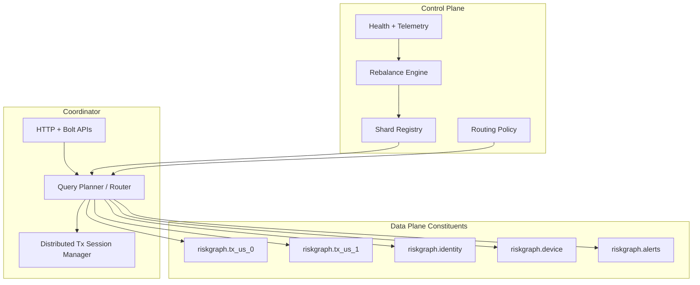
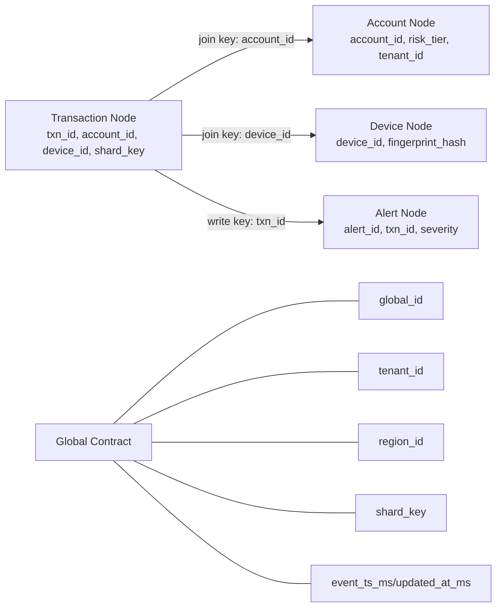
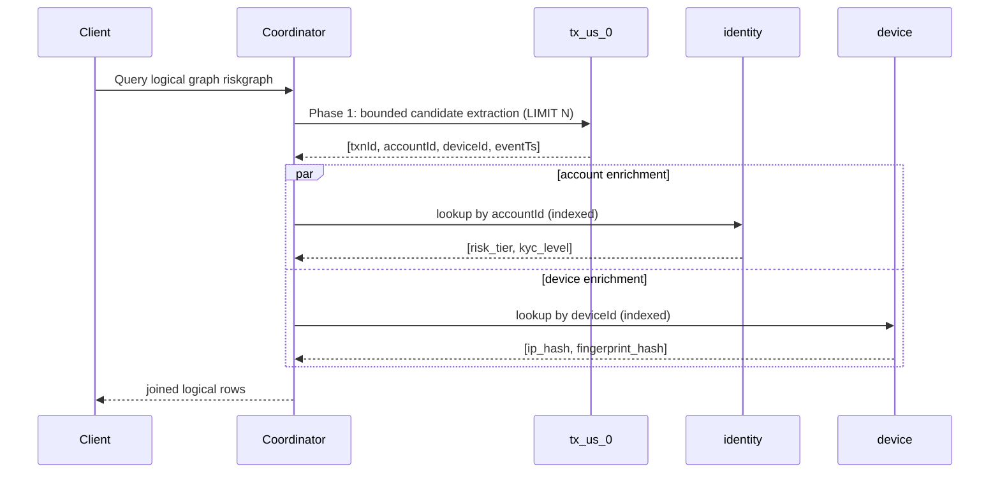
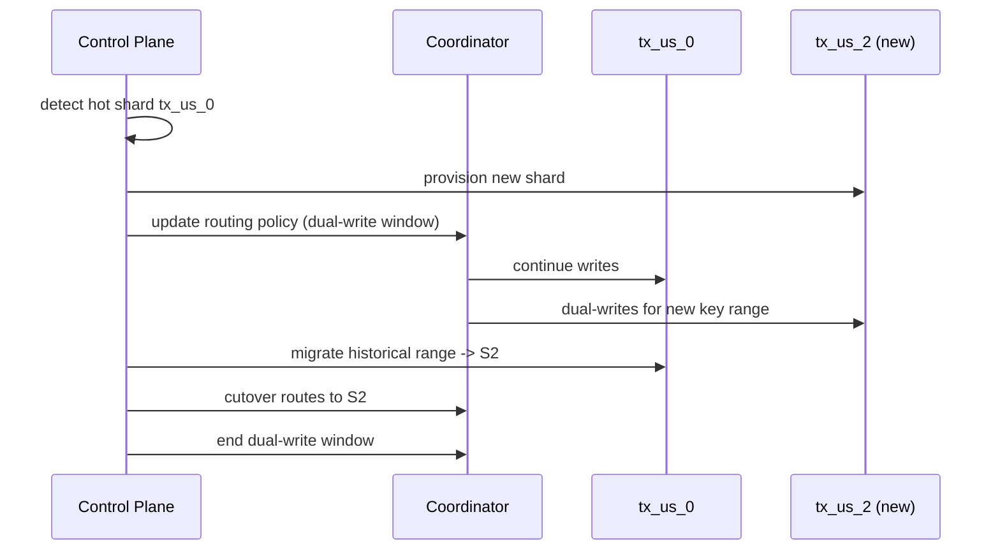

# Re-Implementing Neo4j Infinigraph Topology on NornicDB

This guide is **not** a generic Fabric/federation guide.
It is a blueprint for implementing the capabilities associated with Neo4j Infinigraph-style managed scale-out behavior on NornicDB.

Assumptions:
- you already know basic composite DB creation
- you already run NornicDB in multi-database mode
- you want to build a managed-service-style, horizontally scalable graph platform

## What Infinigraph Adds (Beyond Basic Fabric)

Based on Neo4j’s public Infinigraph messaging/docs, the core differentiators are:

1. automatic horizontal sharding
2. one logical graph at very large scale (not fragmented operationally)
3. unified operational + analytical workloads in one platform
4. ACID transactional guarantees at distributed scale
5. managed operations model (elasticity, rebalancing, observability)

References:
- https://neo4j.com/press-releases/neo4j-launches-infinigraph/
- https://neo4j.com/blog/graph-database/infinigraph-scalable-architecture/
- https://neo4j.com/docs/operations-manual/current/introduction/

## NornicDB Target Architecture (Infinigraph-Oriented)

To emulate those capabilities in NornicDB, implement these layers together:

- **Data Plane**: constituent shard databases (local and remote)
- **Routing Plane**: deterministic shard routing by `shard_key`
- **Query Plane**: composite + routed subqueries with strict key contracts
- **Transaction Plane**: explicit distributed tx session model (many-read/one-write rule)
- **Control Plane**: shard registry, health, rebalance, per-shard telemetry, policy-driven autoscaling

Without all five, you only have basic federation, not an Infinigraph-style offering.

## Prime Example: Global Payments Risk Graph

This is a high-scale use case where Infinigraph-style design is critical.

Logical graph: `riskgraph`

Constituents:
- `riskgraph.tx_us_0`, `riskgraph.tx_us_1`, ... (transaction shards)
- `riskgraph.identity` (accounts, KYC)
- `riskgraph.device` (fingerprints, session/device graph)
- `riskgraph.merchant` (merchant risk graph)
- `riskgraph.alerts` (detections and case workflow)

This is intentionally not a translation example. It models the 100TB+ class graph pattern (high write rate + deep analytical traversals).


## Visual Implementation Steps

### Step 1: Control Plane + Data Plane Topology



### Step 2: Property Contract Across Constituents



### Step 3: Bounded Cross-Constituent Query Flow



### Step 4: Online Shard Split / Rebalance



## Property Contract (Mandatory)

To keep one logical graph behavior across shards, every cross-domain entity must carry canonical keys.

Required properties on participating nodes:

- `global_id` (string, immutable)
- `tenant_id` (string)
- `region_id` (string)
- `shard_key` (string, deterministic routing key)
- `event_ts_ms` (int64)
- `updated_at_ms` (int64)
- `source_system` (string)

Cross-constituent FK keys (examples):

- `account_id`
- `txn_id`
- `device_id`
- `card_hash`
- `merchant_id`

Hard rules:
- never join across constituents using internal node IDs
- never use mutable fields for joins
- never allow mixed datatype for same key across shards

## Concrete Node Structures

### `riskgraph.identity` -> `:Account`

```cypher
{
  global_id: "acct:8f07f5ad9b",
  account_id: "8f07f5ad9b",
  tenant_id: "bank_a",
  region_id: "us",
  shard_key: "bank_a|8f07f5ad9b",
  kyc_level: "high",
  risk_tier: "medium",
  updated_at_ms: 1773400100000,
  source_system: "kyc-service"
}
```

### `riskgraph.tx_us_*` -> `:Transaction`

```cypher
{
  global_id: "txn:2f2be7db8f3a",
  txn_id: "2f2be7db8f3a",
  account_id: "8f07f5ad9b",
  device_id: "dev:4fd2a1",
  card_hash: "card:sha256:...",
  merchant_id: "m_9021",
  amount_minor: 129900,
  currency: "USD",
  tenant_id: "bank_a",
  region_id: "us",
  shard_key: "bank_a|us|2f2be7db8f3a",
  event_ts_ms: 1773410000123,
  updated_at_ms: 1773410000200,
  source_system: "payments-gateway"
}
```

### `riskgraph.device` -> `:DeviceIdentity`

```cypher
{
  global_id: "dev:4fd2a1",
  device_id: "dev:4fd2a1",
  account_id: "8f07f5ad9b",
  fingerprint_hash: "fp:sha256:...",
  ip_hash: "ip:sha256:...",
  tenant_id: "bank_a",
  region_id: "us",
  shard_key: "bank_a|dev:4fd2a1",
  updated_at_ms: 1773410000050,
  source_system: "fraud-sensor"
}
```

## Index Policy (Per Constituent, Not Composite Root)

```cypher
USE riskgraph.identity
CREATE INDEX acct_account_id_idx FOR (n:Account) ON (n.account_id)

USE riskgraph.tx_us_0
CREATE INDEX tx0_txn_id_idx FOR (n:Transaction) ON (n.txn_id)
CREATE INDEX tx0_account_id_idx FOR (n:Transaction) ON (n.account_id)
CREATE INDEX tx0_device_id_idx FOR (n:Transaction) ON (n.device_id)
CREATE INDEX tx0_event_ts_idx FOR (n:Transaction) ON (n.event_ts_ms)

USE riskgraph.device
CREATE INDEX dev_device_id_idx FOR (n:DeviceIdentity) ON (n.device_id)
CREATE INDEX dev_account_id_idx FOR (n:DeviceIdentity) ON (n.account_id)
```

## Query Shape for Infinigraph-Style Scale

Pattern:
1. bounded candidate extraction from sharded transaction domain
2. key-based enrichment on identity/device/merchant domains
3. optional write to alerts domain in separate write transaction

```cypher
USE riskgraph
CALL {
  USE riskgraph.tx_us_0
  MATCH (t:Transaction)
  WHERE t.event_ts_ms >= $windowStartMs
    AND t.amount_minor >= $minAmount
  RETURN t.txn_id AS txnId,
         t.account_id AS accountId,
         t.device_id AS deviceId,
         t.card_hash AS cardHash,
         t.event_ts_ms AS eventTs
  ORDER BY t.event_ts_ms DESC
  LIMIT 1000
}
CALL {
  WITH accountId
  USE riskgraph.identity
  MATCH (a:Account)
  WHERE a.account_id = accountId
  RETURN a.risk_tier AS accountRisk, a.kyc_level AS kycLevel
}
CALL {
  WITH deviceId
  USE riskgraph.device
  MATCH (d:DeviceIdentity)
  WHERE d.device_id = deviceId
  RETURN d.ip_hash AS ipHash, d.fingerprint_hash AS fingerprint
}
RETURN txnId, accountId, deviceId, cardHash, eventTs, accountRisk, kycLevel, ipHash, fingerprint
ORDER BY eventTs DESC
```

Why this aligns with Infinigraph goals:
- avoids global scans
- avoids data copy pipelines
- preserves full-fidelity entity correlation through canonical keys
- supports real-time transactional reads with analytical enrichment

## Managed-Service Capability Checklist (Infinigraph Parity Targets)

Implement these as product capabilities, not ad hoc scripts:

1. **Automatic shard assignment**
   - deterministic `shard_key` hash ring
   - online shard map updates
2. **Shard auto-split / rebalance**
   - threshold-based split policies
   - live move + dual-write cutover during migration window
3. **Global query routing**
   - route by key when possible
   - bounded fan-out when key unknown
4. **Unified OLTP + analytics**
   - same logical graph, same source-of-truth data
   - no ETL shadow graph for analytics path
5. **Distributed transaction semantics**
   - explicit tx across participants
   - documented guarantees and failure handling
6. **Operational control plane**
   - shard registry, health, lag, skew, hot-shard detection
   - policy-driven scale-out recommendations
7. **Tenant/region isolation policies**
   - routing constraints by `tenant_id`/`region_id`
   - auth propagation and RBAC boundaries across remote constituents

If your system lacks these, it is federation; if it has these, it behaves like an Infinigraph-style managed platform.

## Anti-Patterns (Will Break Scale)

- cross-constituent joins on mutable attributes
- joining on unindexed keys
- relationship-heavy designs that require physical cross-shard edges
- uncontrolled fan-out queries without bounded candidate phase
- per-shard schema drift for shared keys

## Operational Validation Queries

### Missing required keys

```cypher
USE riskgraph.tx_us_0
MATCH (t:Transaction)
WHERE t.txn_id IS NULL OR t.account_id IS NULL OR t.device_id IS NULL
RETURN count(t) AS missingKeys
```

### Orphan device references

```cypher
USE riskgraph
CALL {
  USE riskgraph.tx_us_0
  MATCH (t:Transaction)
  WHERE t.device_id IS NOT NULL
  RETURN DISTINCT t.device_id AS deviceId
  LIMIT 10000
}
CALL {
  WITH deviceId
  USE riskgraph.device
  MATCH (d:DeviceIdentity)
  WHERE d.device_id = deviceId
  RETURN count(d) AS c
}
WITH deviceId, c
WHERE c = 0
RETURN deviceId
LIMIT 100
```

## Final Guidance

To reverse-engineer Infinigraph capabilities on NornicDB, treat composites as only one component.
The differentiator is the combination of:
- strict cross-shard property contracts
- deterministic shard routing
- rebalance automation
- query planning that preserves one logical graph behavior
- operational control-plane maturity

That combination is what turns a Fabric-style federation into an Infinigraph-style managed graph service.
